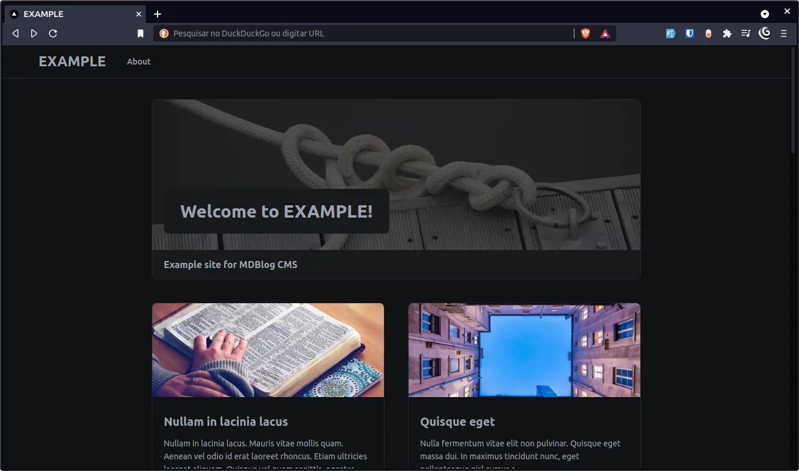

# MDBlog

This is a serverless blog experiment to demonstrate integration with [mdblog-cms](https://github.com/endopedro/mdblog-cms) API. It uses only the endpoints and convert the Markdown content into beautiful posts.

## It's alive

[https://mdblog.vercel.app/](https://mdblog.vercel.app/)

## Screenshots




## About the project

This project uses all [mdblog-cms](https://github.com/endopedro/mdblog-cms) public APIs to show the blog information. The minimalist layout is focused on images, texts and performance. For styles was used Tailwind and for other features, Next.js.

## Stack

- [React](https://reactjs.org/)
- [Next.js](https://nextjs.org)
- [Tailwind](https://tailwindcss.com/)

## Getting Started

1. Clone the repository

```bash
git clone https://github.com/endopedro/mdblog.git
```

2. Then create and fill the .env file (based on .env.example) with your services credentials and app information.

3. Install dependencies

```bash
yarn
```

4. Fire up the server and watch files

```bash
yarn dev
```

5. Go to the address [http://localhost:3000/](http://localhost:3000/)
